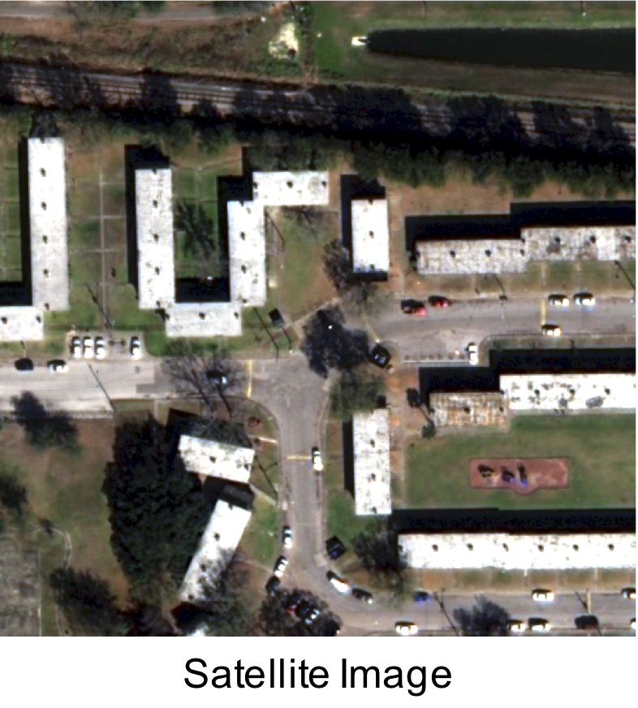
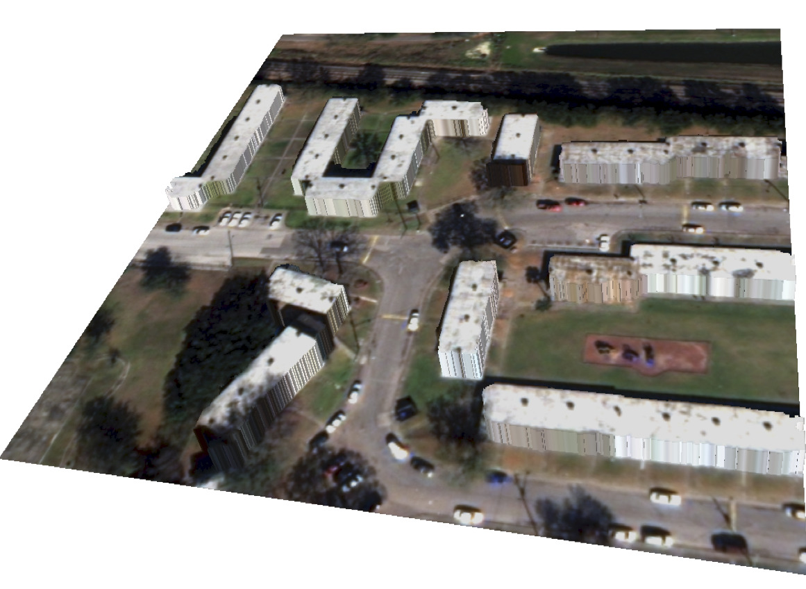
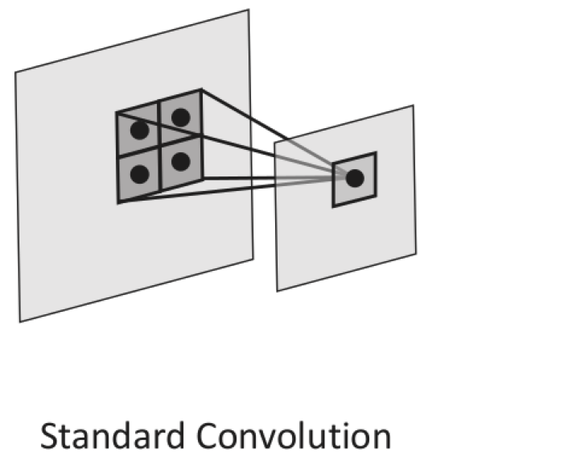
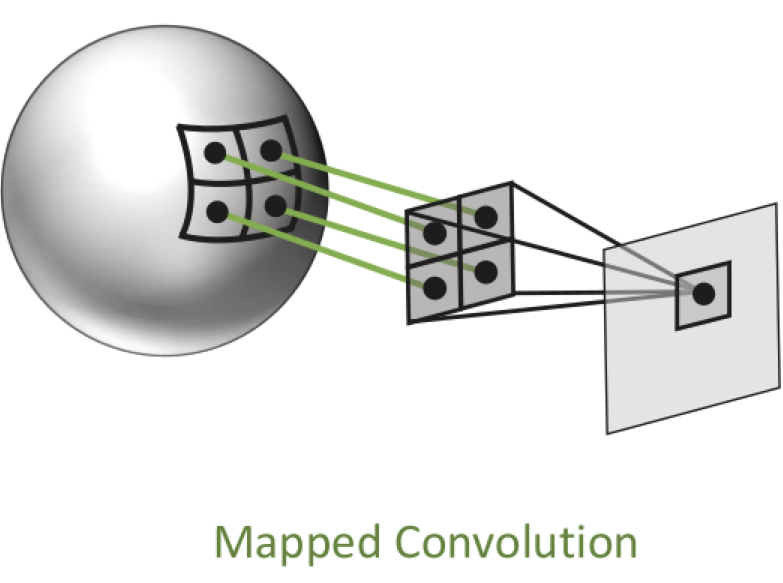
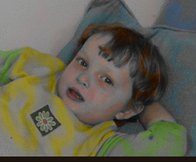
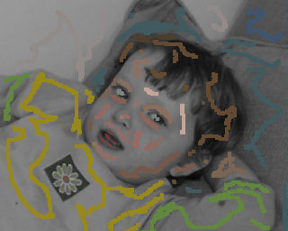
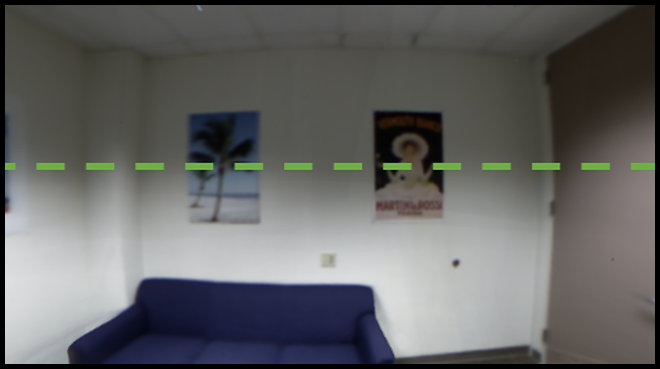
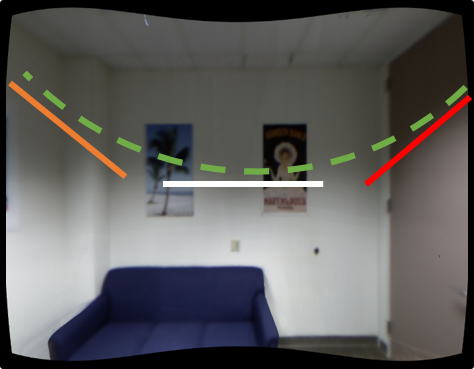
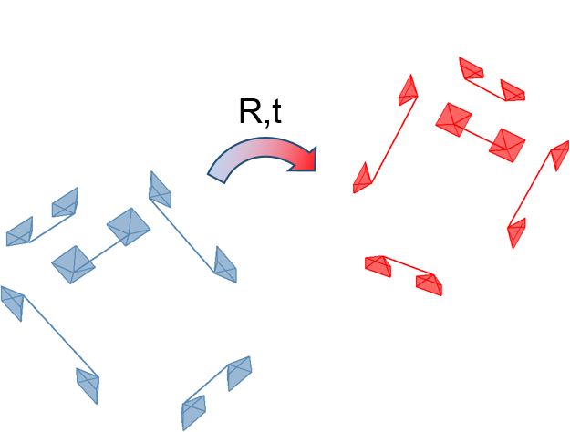

## Akash Bapat | Computer Vision
Hi, my name is Akash Bapat.
I am a Research Scientist and I work in the field of Augmented and Virtual Reality at Meta Inc.
Previously, I completed my Ph.D from the computer science department of UNC Chapel Hill and was
advised by <a href="http://frahm.web.unc.edu/">Jan-Michael Frahm</a>.
My research interests can be traced to my <a href="http://www.iitgn.ac.in/">
IITGN</a> days where I worked with Prof.
<a href="http://www.iitgn.ac.in/faculty/electrical/shanmuganathan.htm">
Raman</a>.

## Recent News
* Our paper on stereo system for smart glasses was accepted at CVPR 20223, see <a href="https://arxiv.org/abs/2211.10551">arxiv</a>

## Papers
<table style="width:100%">
<!---------------------------------------------------------------------------->
<tr>
  <td style="padding:20px;width:40%;vertical-align:middle">
    

  </td>
  <td width="60%" valign="middle">
    <a href = "https://arxiv.org/abs/2211.10551">
      <strong>A Practical Stereo Depth System for Smart Glasses</strong>
    </a>
     
    <a>Jialiang Wang</a>,
    <a>Daniel Scharstein</a>,
    <strong>Akash Bapat</strong>, and
    <a>many other people</a>
     
    To appear in <em>CVPR</em>, 2023
     
    <a href = "assets/bib/wang2023practical.bib">bibtex</a>
    

    
 End to end stereo ML system for smart glasses.
    

  </td>
</tr>
<!---------------------------------------------------------------------------->
<tr>
  <td style="padding:20px;width:40%;vertical-align:middle">
    

  </td>
  <td width="60%" valign="middle">
    <a href = "https://github.com/akashbapat/akashbapat.github.io/blob/master/assets/pdf/thesis/thesis_small.pdf">
      <strong>Thesis: Towards High-Frequency Tracking and Fast Edge-Aware Optimization</strong>
    </a>
     
    <strong>Akash Bapat</strong>
     
    UNC Chapel Hill Doctoral Thesis.
     
    <a href = "assets/bib/bapat2019towards.bib">bibtex</a>
    

    
 My thesis covering my work on rolling shutter tracking and edge aware optimization.
    

  </td>
</tr>
<!---------------------------------------------------------------------------->
<tr onmouseout="building_sat_recon_stop()" onmouseover="building_sat_recon_start()">
  <td style="padding:20px;width:40%;vertical-align:middle">
    

    

    
  </td>
  <td width="60%" valign="middle">
    <a href = "">
      <strong>Boundary-aware 3D Building Reconstruction from a Single Overhead Image</strong>
    </a>
     
    <a href = "https://www.linkedin.com/in/crysoberil">Jisan Mahmud</a>,
    <a href = "https://www.cs.unc.edu/~jtprice/">True Price</a>,
    <strong>Akash Bapat</strong>, and
    <a href = "http://frahm.web.unc.edu/">Jan-Michael Frahm</a>
     
    Appeared in <em>CVPR</em>, 2020
     
    <a href = "assets/bib/mahmud2020boundary.bib">bibtex</a>
    

    
 Predicts building boundaries, semantics, signed distance function (BPSH) and normalized DSMs using a single overhead or satellite image using a multi-task deep learning framework.
    

  </td>
</tr>
<!---------------------------------------------------------------------------->
<tr onmouseout="mapped_conv_stop()" onmouseover="mapped_conv_start()">
  <td style="padding:20px;width:40%;vertical-align:middle">
    

    

    
  </td>
  <td width="60%" valign="middle">
    <a href = "https://arxiv.org/pdf/1906.11096.pdf">
      <strong>Mapped Convolutions</strong>
    </a>
     
    <a href = "https://www.marceder.com">Marc Eder</a>,
    <a href = "https://www.cs.unc.edu/~jtprice/">True Price</a>,
    <a href = "http://thanhmvu.com/">Thanh Vu</a>,
    <strong>Akash Bapat</strong>, and
    <a href = "http://frahm.web.unc.edu/">Jan-Michael Frahm</a>
     
    <a href = "assets/bib/eder2019mapped.bib">bibtex</a>
    

    
 Decouples weighted sum and sampling in a convolution operation to enable processing 360 imagery which show high levels of distortion.
    

  </td>
</tr>
<!---------------------------------------------------------------------------->
<tr onmouseout="dts_stop()" onmouseover="dts_start()">
  <td style="padding:20px;width:40%;vertical-align:middle">
    

    

    
  </td>
  <td width="60%" valign="middle">
    <a href = "https://github.com/akashbapat/domain_transform_solver/blob/master/paper/dts_solver.pdf">
      <strong>The Domain Transform Solver</strong>
    </a>
     
    <strong>Akash Bapat</strong> and
    <a href = "http://frahm.web.unc.edu/">Jan-Michael Frahm</a>
     
    <em>CVPR</em>, 2019
     
    <a href = "https://arxiv.org/abs/1805.04590"> arxiv</a> /
    <a href = "https://github.com/akashbapat/domain_transform_solver">
    code</a> /
    <a href = "assets/bib/bapat2019domain.bib"> bibtex</a>
    

    
 Fast edge-aware optimization can be done by using approximate 1-D filtering techniques.
    

  </td>
</tr>
<!---------------------------------------------------------------------------->
<tr onmouseout="rd_tracking_stop()" onmouseover="rd_tracking_start()">
  <td style="padding:20px;width:40%;vertical-align:middle">
    

    

    
  </td>
  <td width="60%" valign="middle">
    <a href = "assets/pdf/rd_tracking/radial_distortion_tracking_cvpr_18_paper.pdf">
      <strong>Rolling Shutter and Radial Distortion are Features for High Frame Rate
Multi-camera Tracking</strong>
    </a>
     
    <strong>Akash Bapat</strong>,
    <a href = "https://www.cs.unc.edu/~jtprice/">True Price</a> and
    <a href = "http://frahm.web.unc.edu/">Jan-Michael Frahm</a>
     
    <em>CVPR</em>, 2018
     
    <a href = "assets/pdf/rd_tracking/radial_distortion_tracking_cvpr_18_poster.pdf">
    poster</a> /
    <a href = "assets/pdf/rd_tracking/radial_distortion_tracking_cvpr_18_supplementary.pdf">
    supp</a> /
    <a href = "assets/bib/bapat2018rolling.bib"> bibtex</a>
    

    
 Radial distortion induces multiple virtual rolling shutter cameras. Using these virtual cameras, we can better constrain the head-pose motion and still track at a high-frequency.
    

  </td>
</tr>
<!---------------------------------------------------------------------------->
<tr>
  <td style="padding:20px;width:40%;vertical-align:middle">
    

  </td>
  <td width="60%" valign="middle">
    <a href = "assets/pdf/rs_tracking/Bapat_Dunn_Frahm_ISMAR2016.pdf">
      <strong>Towards Kilo-Hertz 6-DoF Visual Tracking Using an Egocentric Cluster of Rolling Shutter Cameras</strong>
    </a>
     
    <strong>Akash Bapat</strong>,
    <a href = "https://www.cs.stevens.edu/~edunn/">Enrique Dunn</a> and
    <a href = "http://frahm.web.unc.edu/">Jan-Michael Frahm</a>
     
    <em>ISMAR/TVCG</em>, 2016, <strong style="color:Red;">Best Paper Award</strong>
     
    <a href = "assets/pdf/rs_tracking/paper135TalkDistribute.pdf">
    talk</a> /
    <a href = "assets/bib/bapat2016towards.bib"> bibtex</a>
    

    
 Rolling shutter exposure provides us with a high fequency of row-image samples. If we can estimate a pose per-row, then we have a high-frequency tracker.
    

  </td>
</tr>
</table>
