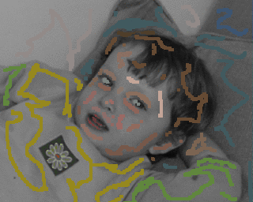

#Akash Bapat | Computer Vision
Hi, my name is Akash Bapat.
I am a Ph.D student in the computer science department of UNC Chapel Hill 
advised by <a href="http://frahm.web.unc.edu/">Jan-Michael Frahm</a>.
My interests are computer vision and augmented and virtual reality.
My research interests can be traced to my <a href="http://www.iitgn.ac.in/">
IITGN</a> days where I worked with Prof. 
<a href="http://www.iitgn.ac.in/faculty/electrical/shanmuganathan.htm">
Raman</a>.

## Recent News
1. Joining Facebook mid-August.
2. Recently, I defended my Ph.D thesis. YAY!!!

## Papers
<tr onmouseout="dts_stop()" onmouseover="dts_start()">
  <td style="padding:20px;width:25%;vertical-align:middle">
    

    

    
  </td>
  <td style = "padding:20px;width:75%;vertical-align:middle">
    <a href = "https://github.com/akashbapat/domain_transform_solver/blob/master/paper/dts_solver.pdf">
      <papertitle> The Domain Transform Solver</papertitle>
    </a>
     
    <strong> AkashBapat</strong>
    <a href = "http://frahm.web.unc.edu/"> Jan-Michael Frahm</a>
     
    <em> CVPR</em>,2019  
    <a href = "https://arxiv.org/abs/1805.04590"> arxiv</a> /
    <a href = "https://github.com/akashbapat/domain_transform_solver">
    code</a> /
    <a href = "assets/bib/bapat2019domain.bib"> bibtex</a>
    

    
 Fast edge-aware optimization can be done by using approximate 1-D filtering techniques.
    

  </td>
<tr>
